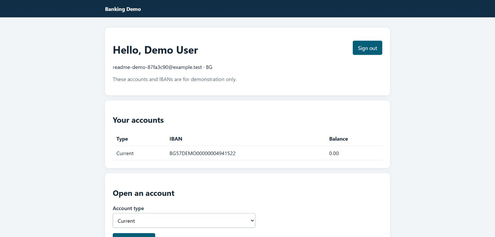

# Banking Application

A .NET 10 and C# 14 banking API prototype using PostgreSQL, EF Core, Npgsql, and ASP.NET Core Identity bearer authentication.

See the [project README](BankingApplication/README.md) for setup, API examples, architecture, tests, and the prototype's limitations.

This is a learning project. Its generated IBANs are demos and cannot be used for payments.

## Browser interface

The project also includes server-rendered pages for registration, sign-in, and account management.

