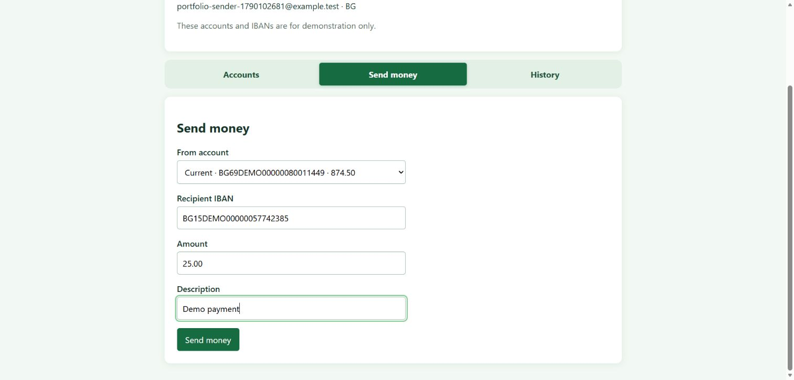
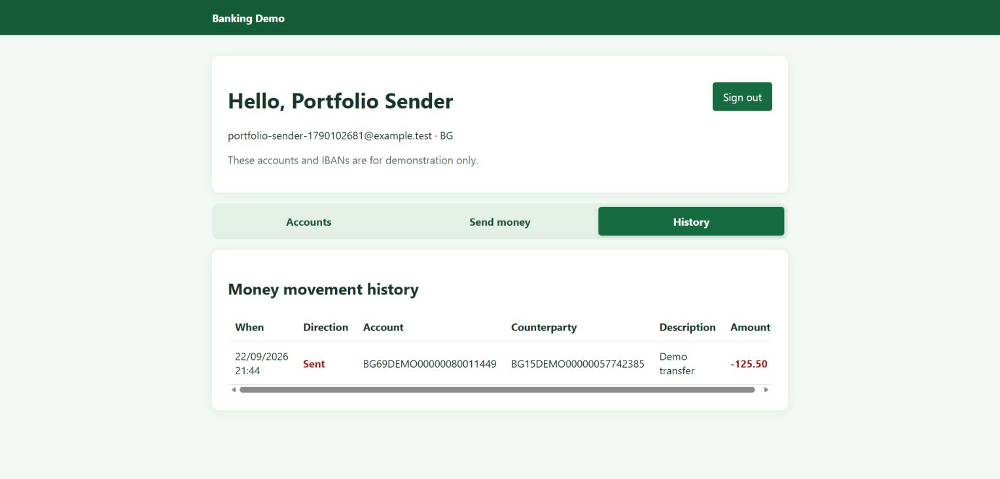
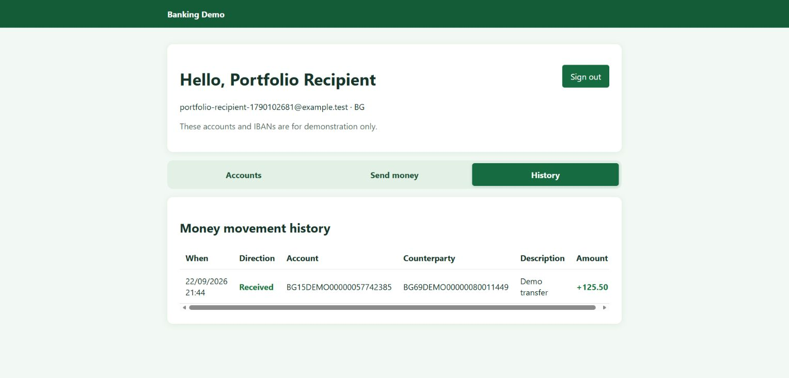
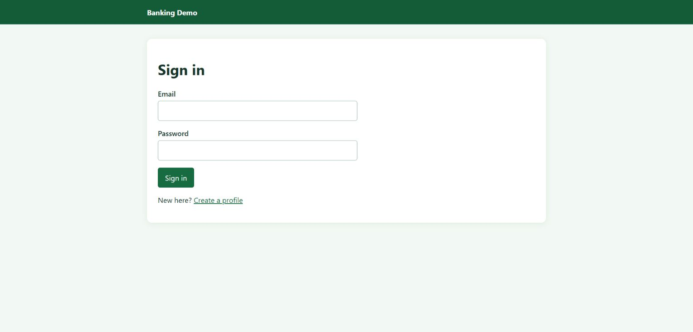
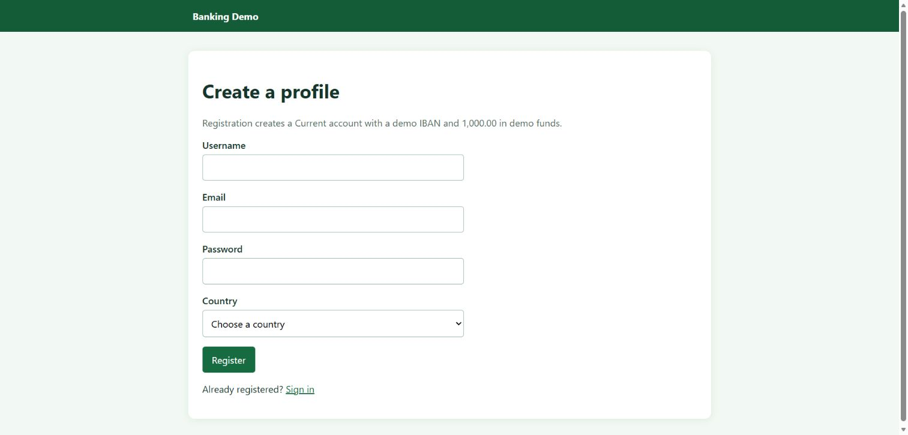

# Banking Application

A .NET 10 and C# 14 banking API prototype using PostgreSQL, EF Core, Npgsql, and ASP.NET Core Identity bearer authentication.

See the [project README](BankingApplication/README.md) for setup, API examples, architecture, tests, and the prototype's limitations.

This is a learning project. Its generated IBANs are demos and cannot be used for payments.

## Browser interface

The green, server-rendered interface includes registration and sign-in pages plus Accounts, Send money, and History tabs for signed-in users.

### Send money

The sender chooses one of their accounts and enters the recipient's demo IBAN, an amount, and an optional description.

### Sent and received history

The same transfer appears as sent for the sender and received for the recipient. The balance changes and movement record are committed in one database transaction.

### Authentication

